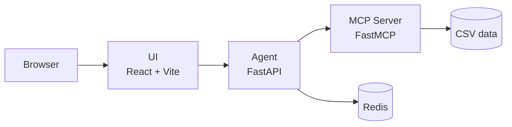

# Owkin Gene Expression Chat

A conversational interface for exploring gene expression data across cancer types, powered by Claude and MCP (Model Context Protocol).

Ask questions like "What genes are involved in lung cancer?" or "Plot the median expression of breast cancer genes" and get answers grounded in real data.

## Architecture



| Service        | Port | Description                                      |
| -------------- | ---- | ------------------------------------------------ |
| **mcp-server** | 8080 | Exposes gene expression data as MCP tools        |
| **agent**      | 8000 | Orchestrates Claude API calls and tool execution |
| **ui**         | 8501 | React frontend with streaming responses          |
| **redis**      | 6379 | Session persistence and data caching             |

## Quick start

### Prerequisites

- [Docker](https://docs.docker.com/get-docker/) and Docker Compose
- An [Anthropic API key](https://console.anthropic.com/)

### Setup

1. Clone the repository and copy the example env file:

   ```bash
   cp .env_example.agent .env.agent
   ```

2. Edit `.env.agent` and add your Anthropic API key:

   ```env
   ANTHROPIC_API_KEY=sk-ant-...
   ```

3. Start all services:

   ```bash
   docker compose up --build
   ```

4. Open [http://localhost:8501](http://localhost:8501) in your browser.

### Development mode

For live-reloading during development:

```bash
docker compose watch
```

## Project structure

```text
.
├── src/mcp_server/          MCP server (gene expression tools)
├── packages/
│   └── agent/               Claude agent (FastAPI + session management)
├── ui/                      React frontend (Vite, TypeScript, Plotly)
├── data/                    Gene expression CSV dataset
├── tests/                   Root-level tests (dataset, agent eval)
├── compose.yml              Docker Compose orchestration
├── Dockerfile               MCP server image
└── Dockerfile.package       Agent package image
```

See individual package READMEs for more detail:

- [packages/agent/README.md](packages/agent/README.md)
- [ui/README.md](ui/README.md)

## Testing

Run unit and integration tests (no API key required):

```bash
uv sync --dev --all-packages
uv run pytest
```

Run agent evaluation tests (requires API key):

```bash
ANTHROPIC_API_KEY=sk-ant-... uv run pytest tests/test_agent_responses.py -v
```

These can also be triggered via GitHub Actions **workflow_dispatch**.

Run UI tests:

```bash
cd ui && yarn test
```

## Environment variables

| Variable            | Required | Default                    | Description                         |
| ------------------- | -------- | -------------------------- | ----------------------------------- |
| `ANTHROPIC_API_KEY` | Yes      | -                          | Anthropic API key (in `.env.agent`) |
| `ANTHROPIC_MODEL`   | No       | `claude-sonnet-4-20250514` | Claude model to use                 |
| `MCP_SERVER_URL`    | No       | `http://localhost:8080`    | MCP server URL                      |
| `REDIS_URL`         | No       | `redis://localhost:6379`   | Redis connection URL                |
| `AGENT_URL`         | No       | `http://localhost:8000`    | Agent API URL (for the UI)          |

## CI

GitHub Actions runs on push/PR to `main`:

- **ruff** - lint and format check
- **ty** - type checking (per package, only on changed paths)
- **pytest** - unit and integration tests (excludes agent eval)
- **ui-typecheck** - TypeScript type checking for the React UI
- **agent-eval** - manual dispatch only, runs Claude-based tests with API key from secrets
